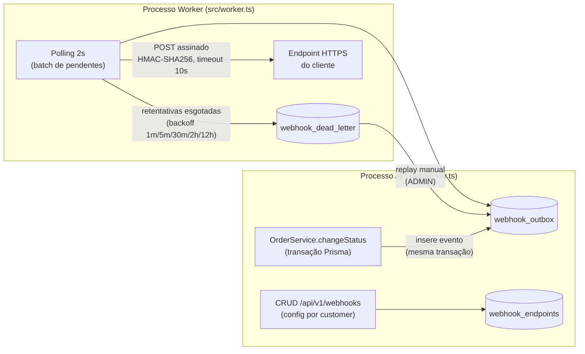

# RFC: Sistema de Webhooks de Notificação de Pedidos

| Campo | Valor |
|---|---|
| Autora | Larissa (Tech Lead) |
| Revisores | Marcos (PM), Bruno (Eng. Pleno, Pedidos), Diego (Eng. Sênior, Plataforma), Sofia (Segurança) |
| Status | Em revisão |
| Data | Reunião de quinta-feira, 09:00 (conforme cabeçalho da `TRANSCRICAO.md`; data de calendário não registrada) |
| Documentos relacionados | [PRD](PRD.md) · [FDD](FDD.md) · [ADRs](adrs/) |

## TL;DR

Propomos notificar sistemas de clientes B2B a cada mudança de status de pedido via **webhooks outbound assinados**, usando o **padrão Outbox no MySQL existente**: o evento é gravado na tabela `webhook_outbox` **dentro da mesma transação** que muda o status do pedido, e um **worker em processo separado** (polling de 2s) entrega os eventos por HTTP com **HMAC-SHA256**, **retry com backoff exponencial (5 tentativas)** e **DLQ** para falhas permanentes. Sem infraestrutura nova — nenhum broker, nenhuma fila externa. Garantia de entrega **at-least-once**, com deduplicação pelo cliente via `X-Event-Id`.

## Contexto e problema

Três clientes B2B — Atlas Comercial, MaxDistribuição e Nova Cargo — pediram formalmente notificação em "tempo real" (definido por eles como **menos de 10 segundos** — [09:02] Marcos) quando o status de seus pedidos muda. Hoje eles fazem polling no `GET /orders` "de tempos em tempos", o que deixa a integração "lenta e cara"; a Atlas sinalizou que pode migrar para o concorrente se isso não for entregue até o fim do trimestre ([09:00] Marcos).

O OMS atual (Node.js/TypeScript/Express/Prisma/MySQL) **não possui nenhum mecanismo de eventos, filas ou notificação externa**. O ciclo de vida do pedido tem máquina de estados controlada e uma transação que atualiza `orders`, insere em `order_status_history` e ajusta estoque (`src/modules/orders/order.service.ts` — transação descrita em [09:04] Bruno; o método `changeStatus` é nomeado em [09:40] Bruno). Qualquer solução precisa preservar essa atomicidade: não pode existir status alterado sem evento registrado, nem evento sem status alterado ([09:06] Diego).

O fluxo é exclusivamente **outbound** — a plataforma notifica os clientes, nunca recebe ([09:02] Marcos, [09:03] Sofia).

## Proposta técnica

Visão geral da arquitetura (detalhamento de implementação no [FDD](FDD.md)):

1. **Publicação transacional (Outbox)** — Na transição de status, `changeStatus` chama uma função pura `publishWebhookEvent(tx, order, fromStatus, toStatus)` que insere o evento na `webhook_outbox` usando o mesmo transaction client. Rollback da transação descarta o evento junto ([09:06] Diego; [09:40–09:41] Bruno/Diego). O filtro por status assinado pelo endpoint é aplicado **na inserção**: se nenhum webhook do customer escuta aquela transição, nada é gravado ([09:34] Bruno/Diego). O payload é um **snapshot** renderizado no momento da inserção ([09:52] Larissa/Diego/Bruno). → [ADR-001](adrs/ADR-001-padrao-outbox-no-mysql.md), [ADR-007](adrs/ADR-007-payload-snapshot-na-insercao.md)

2. **Worker separado em polling** — Novo entry-point `src/worker.ts` (script `npm run worker`), mesmo banco e mesma stack, processo independente da API. A cada 2 segundos lê os pendentes mais antigos em batch pequeno (índices em status e `created_at`) e dispara os POSTs. Single-worker nesta fase: ordering garantido apenas por `order_id` ([09:09–09:13] Diego/Larissa). → [ADR-002](adrs/ADR-002-worker-em-processo-separado-com-polling.md)

3. **Resiliência: retry + DLQ** — Timeout de 10s por chamada ([09:42] Diego); em falha, backoff exponencial 1m/5m/30m/2h/12h (janela total ~15h). Esgotadas as 5 retentativas, o evento vai para `webhook_dead_letter` (payload, motivo, timestamp), com replay manual via endpoint restrito a ADMIN e auditado ([09:15–09:18] Diego/Larissa; [09:36] Sofia). → [ADR-003](adrs/ADR-003-retry-com-backoff-exponencial-e-dlq.md)

4. **Segurança** — Corpo assinado com **HMAC-SHA256** e **secret única por endpoint**, gerada pela plataforma; rotação com grace period de 24h; URL obrigatoriamente HTTPS (validação Zod); headers `X-Signature`, `X-Event-Id`, `X-Timestamp`, `X-Webhook-Id`; payload limitado a 64KB, com erro se ultrapassar ([09:20–09:24] Sofia/Diego/Larissa; [09:44–09:45] Diego/Sofia). → [ADR-004](adrs/ADR-004-hmac-sha256-com-secret-por-endpoint.md)

5. **Semântica de entrega** — **At-least-once**: duplicatas são possíveis (retry, replay); o cliente deduplica pelo `X-Event-Id` (UUID atribuído na inserção na outbox), como fazem Stripe e GitHub ([09:24–09:26] Diego/Larissa). → [ADR-005](adrs/ADR-005-entrega-at-least-once-com-x-event-id.md)

6. **Aderência ao código existente** — Novo módulo `src/modules/webhooks` no padrão controller/service/repository/routes/schemas; reuso de `AppError` (códigos `WEBHOOK_*`), Pino, error middleware, Zod, `requireRole` e UUIDs ([09:27–09:30] Bruno/Larissa). → [ADR-006](adrs/ADR-006-reuso-dos-padroes-existentes-do-projeto.md)

A API pública ganha o CRUD de configuração de webhooks por customer, rotação de secret, histórico de entregas (últimas ~100 — [09:34] Marcos) e o replay de DLQ (contratos completos no [FDD](FDD.md)).

## Alternativas consideradas

| Alternativa | Trade-off que motivou o descarte |
|---|---|
| **Disparo síncrono no `changeStatus`** | A transação de mudança de status já é pesada; cliente lento ou fora do ar travaria mudanças de status de outros pedidos, e falha do cliente exigiria rollback de uma transição legítima — inaceitável ([09:04] Bruno; [09:06] Diego: "Síncrono está fora de questão"). |
| **Fila externa (Redis Streams / message broker)** | Resolveria o desacoplamento, mas exige subir e operar infraestrutura nova. "A gente é um time pequeno. Subir Redis Cluster pra isso é overengineering. Outbox no MySQL existente resolve" ([09:07] Larissa/Diego). |
| **Trigger de banco para reatividade** | MySQL não tem mecanismo nativo de notificação a processo externo (sem equivalente ao NOTIFY/LISTEN do Postgres); trigger só executa SQL, e improvisos ficam "esquisitos". Polling de 2s já atende o requisito de <10s ([09:09] Bruno/Diego). |
| **Exactly-once** | Exigiria coordenação dos dois lados e complexidade muito maior; at-least-once com dedup por `X-Event-Id` "resolve 99% dos casos" ([09:25] Diego). |
| **Secret global da plataforma** | "Se vaza uma, vaza tudo" — secret por endpoint contém o raio de dano de um vazamento ([09:21] Sofia). |

## Questões em aberto

1. **Rate limiting de saída** — Cliente com 50 mudanças de status em um minuto recebe 50 chamadas. Decisão adiada: "a gente observa e implementa se virar problema" ([09:38–09:39] Diego/Larissa).
2. **Endurecimento de roles no CRUD de configuração** — Nesta fase qualquer usuário autenticado gerencia webhooks (customer_id vem do body/path, não do JWT); "mais pra frente a gente pode endurecer" ([09:32] Larissa; [09:37] Sofia).
3. **Escala do worker** — Múltiplos workers exigiriam particionamento por `order_id` ou lock para preservar ordering; "problema do futuro, não agora" ([09:13] Diego).

## Impacto e riscos

- **Banco**: novas tabelas (`webhook_endpoints`, `webhook_outbox`, `webhook_dead_letter`, registro de entregas); a outbox cresce sem arquivamento nesta fase (arquivamento explicitamente fora de escopo — [09:08] Diego). O worker adiciona um pool de conexões Prisma próprio contra o mesmo MySQL ([09:30] Bruno).
- **Módulo de pedidos**: `changeStatus` ganha um passo a mais na transação — ponto mais sensível da integração; falha na inserção da outbox faz rollback da mudança de status ([09:40] Bruno).
- **Operação**: novo processo para deployar e monitorar (`npm run worker`); DLQ depende de intervenção manual (sem e-mail ao cliente nesta fase — [09:37] Larissa).
- **Prazo**: estimativa de 3 sprints, incluindo revisão de segurança da Sofia (mínimo 2 dias úteis antes do deploy) ([09:46] Larissa/Sofia); compromisso comercial para fim de novembro ([09:45] Marcos).

Riscos com probabilidade × impacto × mitigação no [PRD](PRD.md); matriz de erros e critérios de aceite técnicos no [FDD](FDD.md).

## Decisões relacionadas

- [ADR-001 — Padrão Outbox no MySQL](adrs/ADR-001-padrao-outbox-no-mysql.md)
- [ADR-002 — Worker em processo separado com polling](adrs/ADR-002-worker-em-processo-separado-com-polling.md)
- [ADR-003 — Retry com backoff exponencial e DLQ](adrs/ADR-003-retry-com-backoff-exponencial-e-dlq.md)
- [ADR-004 — HMAC-SHA256 com secret por endpoint](adrs/ADR-004-hmac-sha256-com-secret-por-endpoint.md)
- [ADR-005 — Entrega at-least-once com X-Event-Id](adrs/ADR-005-entrega-at-least-once-com-x-event-id.md)
- [ADR-006 — Reuso dos padrões existentes do projeto](adrs/ADR-006-reuso-dos-padroes-existentes-do-projeto.md)
- [ADR-007 — Payload snapshot na inserção](adrs/ADR-007-payload-snapshot-na-insercao.md)
